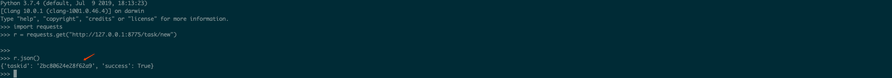

关于sqlmapapi今天看见freebuf上师傅的分享的内容 自己练习

#### 0x01 为什么要使用SQLMAP API

由于SLQMAP每检测一个站点都需要开启一个新的命令行窗口或者结束掉上一个检测任务。虽然-m参数可以批量扫描URL，但是模式也是一个结束扫描后

才开始另一个扫描任务。通过api接口，下发扫描任务就就简单的多，无需开启一个新的命令行窗口

#### 0x02 sqlmap api

sqlmap下载安装后，会在安装目录中存在sqlmapapi.py的文件，sqlmapapi.py文件就是 sqlmapapi，sqlmapapi分为服务端和客户端。有两种模式，

一种是基于HTTP协议的接口你模式，一种是基于命令行的接口模式。


获取sqlmapapi.py的使用帮助

```
python sqlmapapi.py -h 
```


```python
Options:
  -h, --help            显示帮助信息并退出
  -s, --server          做为api服务端运行
  -c, --client          做为api客户端运行
  -H HOST, --host=HOST  指定服务端IP地址 (默认IP是 "127.0.0.1")
  -p PORT, --port=PORT  指定服务端端口 (默认端口8775)
  --adapter=ADAPTER     服务端标准接口 (默认是 "wsgiref")
  --username=USERNAME   可空，设置用户名
  --password=PASSWORD   可空，设置密码
```


#### 0x03 开启api服务端

不管是基于HTTP协议的接口模式还是基于命令行的接口模式，都需要先开启api服务端。如下命令可开启api服务端

```
python sqlmapapi.py -s
```


命令成功后，会在命令行中返回一些信息。大致意思是api服务端在本地8775端口上云翔，admin token为4e5fee0907ab2d102646515d5c4d4003，IPC数据库的位置在/var/folders/f2/kz7bjnl54pd52lj2xnd6b3940000gn/T/sqlmapipc-_Fe7JX，api服务端已经和PIC数据库连接上了，正在使用bottle框架wsgiref标准接口

通过上面的这种方式开启api服务端有一个缺陷，当服务端和客户端不是一台主机会连不上，要解决这个问题，可以用如下命令开启api服务端。命令成功后，远程好客户端就可以指定远程主机IP和端口来连接到API服务端

```
python sqlmapapi.py -s -H "0.0.0.0" -p 8775
```

固定admin tokebn

在有特殊的需求需要固定admin token 可以修改怒文件api.py 在sqlmap目录下的/lib/utils/中，661行，这里我看到的每找对应的源代码

```
DataStore.admin_token = hexencode(os.urandom(16))
```


#### 0x04 sqlmap api的两种模式

命令行接口模式

输入 以下命令，可连接api服务端，进行后期的指令发送操作

```
python sqlmapapi.py -c
```


如果客户端和服务端不是同一台计算机，使用如下命令，执行之后就会进入交互模式

python sqlmapapi.py -c -H "10.19.64.36" -p 8775


命令行接口模式相关命令，使用help查看该接口所有命令的使用方法

```
api> help
help           显示帮助信息
new ARGS       开启一个新的扫描任务
use TASKID     切换taskid
data           获取当前任务返回的数据
log            获取当前任务的扫描日志
status         获取当前任务的扫描状态
option OPTION  获取当前任务的选项
options        获取当前任务的所有配置信息
stop           停止当前任务
kill           杀死当前任务
list           显示所有任务列表
flush          清空所有任务
exit           退出客户端        
```

了解命令行接口模式中的所有命令后，就可以通过一个sql注入来掩饰该模式接口下检测sql注入的流程

检测GET型注入

```
new -u "url"
```

指定了-u参数，从返回的信息中可以看到，输入new命令后，首先请求了/task/new,来创建一个新的taskid，后又发起了一个请求去开始任务，因此可以发现该模式是基于HTTP协议的


通过输入status命令，来获取该任务的扫描状态，若返回内容中华的status字段为terminated，说明扫描完成，若返回内容中的恶status字段为run，说明扫描还在进行中


通过输入data命令，来获取扫描完成后注入出来的信息，若返回的内容中data字段不为空就说明存在注入，如下为返回内容，可看到返回的内容有数据库类型、payload、注入的参数等


字段为空的时候


检测POST型，cookie UA等注入

通过以下命令，在data.txt中加入星号，指定注入的位置，来达到检测POST、cookie、UA等注入的目的

```
new -r data.txt
```

#### 0x05 基于HTTP协议的接口模式

下列都是基于HTTP协议API交互的所有方法：提示“@get”就说明需通过GET请求，“@post”就说明需要通过POST请求的；POST请求需要修给HTTP头中的Content-Type字段为application/json

```python
#辅助
@get('/error/401')    
@get("/task/new")
@get("/task/<taskid>/delete")

#Admin 命令
@get("/admin/list")
@get("/admin/<token>/list")
@get("/admin/flush")
@get("/admin/<token>/flush")

#sqlmap 核心交互命令
@get("/option/<taskid>/list")
@post("/option/<taskid>/get")
@post("/option/<taskid>/set")
@post("/scan/<taskid>/start")
@get("/scan/<taskid>/stop")
@get("/scan/<taskid>/kill")
@get("/scan/<taskid>/status")
@get("/scan/<taskid>/data")
@get("/scan/<taskid>/log/<start>/<end>")
@get("/scan/<taskid>/log")
@get("/download/<taskid>/<target>/<filename:path>")
```

@get('/error/401')

该接口首先需要登录Admin token不然会返回状态码401，具体代码如下

```python
response.status = 401
return response
```

@get("/task/new")

该接口用于创建一个新的任务，使用后会返回一个随机的taskid，具体代码如下

```python
def task_new():
    """
    Create a new task
    """
    taskid = hexencode(os.urandom(8))
    remote_addr = request.remote_addr
    DataStore.tasks[taskid] = Task(taskid, remote_addr)
    logger.debug("Created new task: '%s'" % taskid)
    return jsonize({"success": True, "taskid": taskid})
```

下图是调用该接口的截图



@get("/task//deldete")

该接口用户删除taskid


@get("/admin/list")/@get("/admin//list")

该接口用于返回所有taskid，在调用时指定taskid


@get("/admin/flush")/@get("/admin//flush")

该接口用于删除所有任务，在调用时指定admin token


@get("/option//list")

该接口可获取特定任务ID的列表选项，调用时要指定taksid


@post("/option//set")

该接口为特定任务ID设置选项值，调用时要指定taskid

@post("/scan//start")

该接口定义开始扫描特定任务，调用时请指定taskid

@post("/scan//stop")

该接口定义停止扫描特定任务，调用时要指定taskid

@get("/scan//kill")

该接口可杀死特定任务，需要指定taskid

@get("/scan//data")

该接口可获取到扫描结果，调用时要指定taskid

#### 0x06总结

基于HTTP的接口模式用起来可能比较繁琐，但是对于程序调用接口还是很友善，该模式的流程时

1、通过GET请求http://ip:port/task/new 这个地址，创建一个新的扫描任务；

2、通过POST请求http://ip:port/scan//start地址，并通过json格式提交参数，开启一个扫描；通过GET请求http://ip:port/scan//status地址，即可获取指定的taskid的扫描状态。这个返回值分为两种，一种是run状态（扫描未完成）一种是terminated状态（扫描完成）；

3、扫描完成后获取扫描的结果

#### 0x07使用python3编写sqlmapapi调用程序

编写一个sqlmapapi调用程序，再次明确一下流程

1、通过sqlmapapi.py -s -H “0.0.0.0”开启sqlmap api服务端。服务端启动后，在服务端命令行中会返回一个随机的admin token值，这个值用于管理taskid（获取、清空操作），在这个流程中不需要admin token这个值，可以忽略。之后，服务端会处于一个等待客户端的状态

2、通过GET请求http://ip:port/task/new 这个地址，创建一个新的扫描任务，在响应中会返回一个随机的taskid。这个taskid在这个流程中很重要，因此需要通过变量存储下来，方便后面程序调用

3、通过POST请求http://ip:port/scan//start地址，并通过json格式提交参数（待扫描的HTTP数据包、若存在注入是否获取当前数据库用户名）即可开启一个扫描任务，该请求会返回一个enginedid

4、通过GET请求http://ip:port/scan//status地址，即可获取指定的taskid的扫描状态。这个返回值分为两种，一种是run状态（扫描未完成）一种是terminated状态（扫描完成）

5、判断扫描转台，如果扫描未完成，再次请求http://ip:port/scan//status地址，直到扫描完成。

6、扫描完成后获取扫描的结果，是否是SQL注入，若不存在SQL注入，data字段为空，若存在SQL注入，则会返回数据库类型、payload等等

